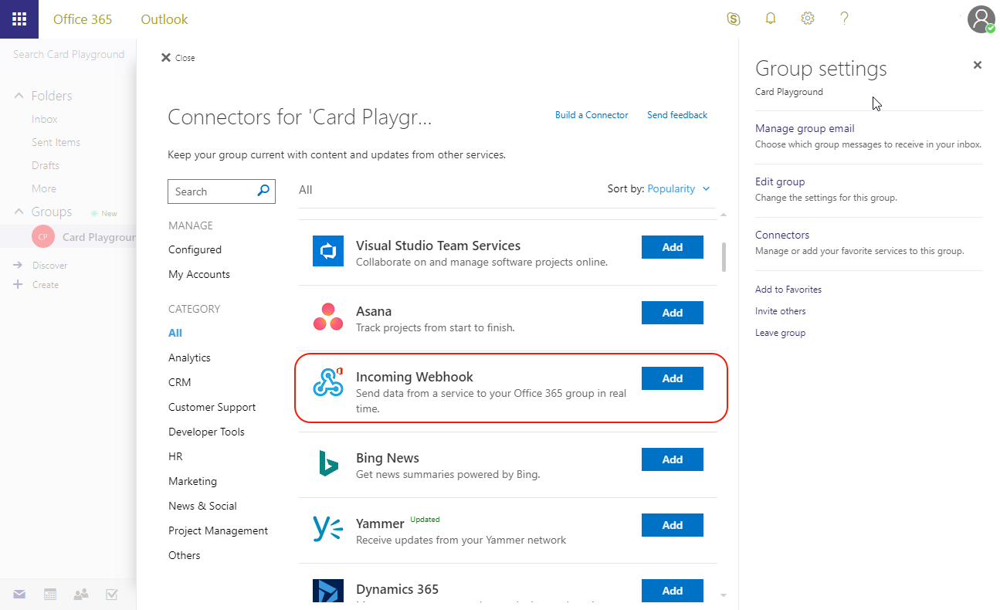
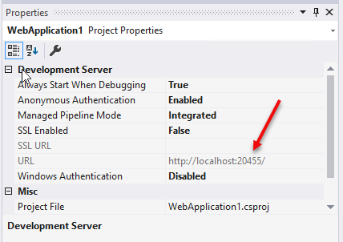
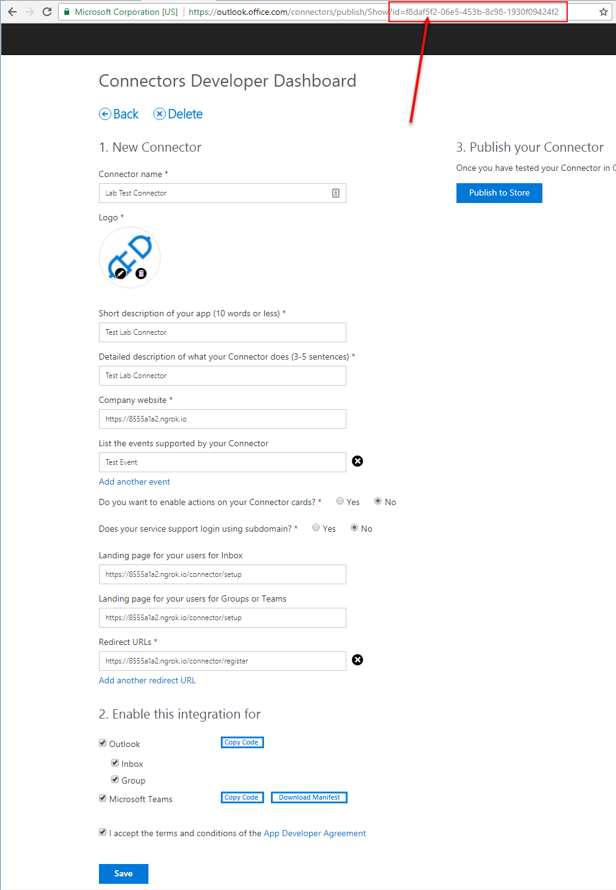
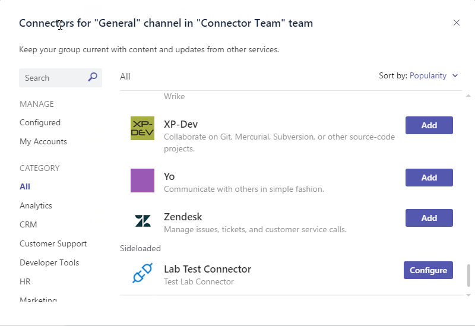
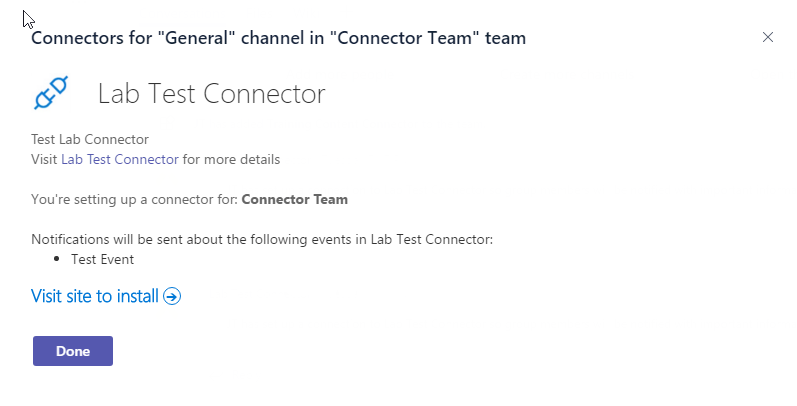
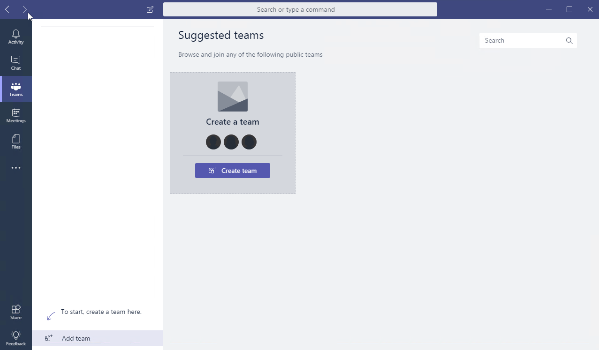
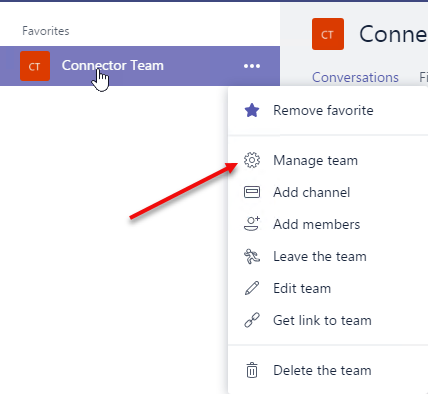
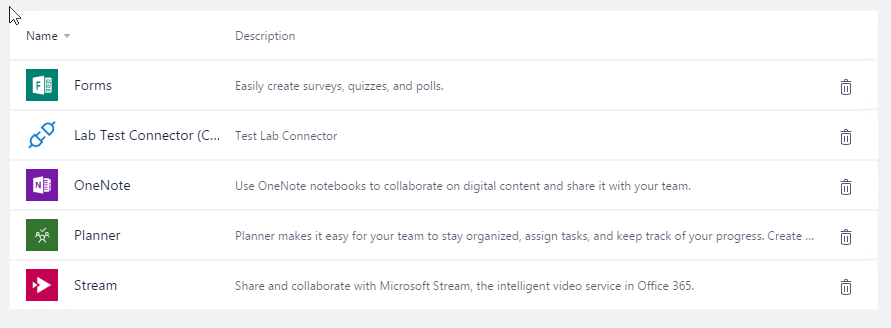
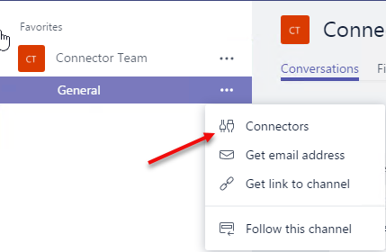

# Build a basic Connector that works with Graph and Teams
----------------
In this lab, you will learn the steps to create and send connector cards to Office 365 Groups and Microsoft Teams, and learn the steps for registering a Connector with the Office 365 Conectors developer dashboard.

## Table of Contents

1. [Create a Card payload and submit it via an Incoming Webhook](#exercise1)
1. [Add functionality to an existing web site](#exercise2)
1. [Sideload Connector to Microsoft Teams](#exercise3)

## Prerequisites ##
This lab will require an Office 365 Tenant and a user account that has a mailbox. The exercises that use Microsoft Teams require additional setup. The tenant setup steps are detailed on the [Getting Started page](https://msdn.microsoft.com/en-us/microsoft-teams/setup). Note that while the Getting Started page indicates that the Public Developer Preview is optional, this lab includes steps that not possible unless the Preview is enabled.

### Install developer tools ###

The developer workstation requires the following tools for this lab.

#### Download ngrok ####
The Connector registration process requires an endpoint accessible from the internet via HTTPS. To enable the exercises to work correctly, a tunneling application is required.

This lab uses [ngrok](https://ngrok.com) for tunneling publicly-available HTTPS endpoints to a web server running locally on the developer workstation. ngrok is a single-file download that is run from a console.

#### Code Editors ####
The steps and code samples in this training use [Visual Studio 2017](https://www.visualstudio.com/) for websites using C#.

<a name="exercise1"></a>

## Exercise 1: Create a Card payload and submit it via an Incoming Webhook
In this exercise, you will copy an example card from the Message Card Playground web site and send it to an Office 365 Group in your tenant.

### Create Group and configure Webhook

1. Open a browser and navigate to **https://outlook.office.com**. Log in with your Office 365 credentials.
1. Create a new Group, or navigate to an existing Group.
1. At the top-left of the screen, click the chevron next to the member count. Choose **Connectors**.

    

1. In the list of Connectors, scroll down and then select **Incoming Webhook**. Click **Add**.

    

1. Enter a name for the connector and click **Create**.
1. The page will re-display, now including a URL for the connector. Click the icon next to the URL to copy it to the clipboard.

    

    > Note: The URL will be used several times in this Exercise, as will the clipboard. We recommend pasting the URL into Notepad or other application.

1. Click **Done**. Then close the Connector flyout.

### Explore MessageCard Playground

1. In another browser tab or window, navigate to **https://messagecardplayground.azurewebsites.net**.
1. The playground site provides for uploading a custom card definition or reviewing several samples. Use the **select a sample** dropdown to select a sample that closely matches your requirements. (The image in this lab uses the **Connectors reference example**, but that is not required.)

    

1. After selecting an example, click **Send via WebHook**.
1. Enter or paste the URL copied earlier from the Group Connector configuration panel.
1. Click **OK**. The card will display in the Outlook Group conversation display. (You may have to click on the **New Activity** indicator to see the card.)

### Send card via PowerShell
It is not necessary to use the playground web site to send test messages. Any facility for sending HTTP POST requests can also send cards to the Group.

1. In the MessageCard Playground site, select a different sample card. (This will be easier to identify in the Conversation view if the cards are different.)
1. Select the JSON and copy it to Notepad.
1. Save the card source as **connector-card.json**.
1. Open **Windows PowerShell** and change to the directory containing the **connector-card.json** file.
1. Execute the following commands:

    ```powershell
    $message = Get-Content .\connector-card.json
    $url = <YOUR WEBHOOK URL>
    Invoke-RestMethod -ContentType "application/json" -Body $message -Uri $url -Method Post
    ```

    

    > The `Invoke-RestMethod` cmdlet will return **1** to indicate success.

<a name="exercise2"></a>

## Exercise 2: Add Connector functionality to existing web site
This exercise will add connector functionality to an existing web site. First, a new website must be created The following steps create and modify the default MVC website template in preparation for adding a connector.

1. Open **Visual Studio 2017**

1. Create a new **ASP.NET Web Application (.NET Framework)** project
    

1. Choose the **MVC** template
    

1. Single click on the `csproj` file and press **F4** to display the Properties pane.

1. Change the value of the `SSL Enabled` property to **true**.

1. Make note of the `SSL URL` property. It is needed for the tunnel application later.

1. Open the `Views/Home/Index.cshtml` file. Replace the contents of this file with the code in the `Lab Files/Home/Index.cshtml` file.

1. Open the `Controllers/HomeController.cs` file. Replace the contents of this file with the code  in the `Lab Files/Home/HomeController.cs` file.

1. Right-click on the `Models` folder and select **Add > Class**. Name the class `HomePage`. Replace the contents of the new file with the code in the `Lab Files/Models/HomePage.cs` file.

1. Right-click on the `Models` folder and select **Add > Class**. Name the class `ConnectorSubmissionResult`. Replace the contents of the new file with the code in the `Lab Files/Models/ConnectorSubmissionResult.cs` file.

1. Press F5 to build and run the project. The default browser should display the home page.
    

1. Stop debugging.


### Run the ngrok secure tunnel application

1. Open a new **Command Prompt** window.
1. Change to the directory that contains the ngrok.exe application.
1. Run the command `ngrok http [port] -host-header=localhost:[port]` *(Replace [port] with the port portion of the URL noted above.)*
1. The ngrok application will fill the entire prompt window. Make note of the Forwarding address using https. This address is required in the next step.
1. Minimize the ngrok Command Prompt window. It is no longer referenced in this lab, but it must remain running.

    


### Register the connector

Following the steps found on [docs.microsoft.com](https://docs.microsoft.com/en-us/outlook/actionable-messages/connectors-dev-dashboard#build-your-own-connector), register a connector for Office 365.

1. For the **Configuration page for your Connector** field, use the Forwarding https address from ngrok prepended to the route to the ConnectorController in the Visual Studio project. In the example, this is `https://d3d2f97f.ngrok.io/Connector`

1. For the **Valid Domains** field, use the Forwarding https address from ngrok. In the example, this is `https://d3d2f97f.ngrok.io`.

1. In the **Enable this integration for** section, select **Outlook**, **Inbox** and **Group**.

1. Agree to the terms and conditions and click **Save**

1. The registration page will refresh with additional information in the integration section on the right. Make note of the **Connector ID** and **Connectors Javascript Library CDN**. This values are used in the following steps.

### Add the Configuration page to the project

1. Return to Visual Studio, with the web project created earlier opened. Stop the debugger.

1. Right-click on the `Controllers` folder and select **Add > Controller**. Select **MVC 5 Controller - Empty**. Name the controller `ConnectorController`.

    

1. In the `Index` method, set the security policy for the page. Replace the contents of the method with the following:

````csharp
public ActionResult Index()
{
  Response.AppendHeader(
    "Content-Security-Policy",
    "frame-ancestors office365.microsoft.com *.office365.microsoft.com"
  );
  return View();
}
````

1. With the cursor inside the `Index` method, right-click and choose **Add View...**. Clear the checkbox for **Use a layout page**.

    

1. Replace the generated HTML with the following. (The code is available in the `Lab Files/Connector/Index.cshtml` file.)

````html
@{
  Layout = null;
}

<!DOCTYPE html>

<html>
<body>
  <form>
    <input type="radio" name="maptype" value="bing" onclick="onClick()"> Bing Maps<br>
    <input type="radio" name="maptype" value="google" onclick="onClick()"> Google Maps
  </form>

  <script src="https://statics.office365.microsoft.com/sdk/v1.0/js/Office365.min.js"></script>

  <script type="text/javascript">
    function onClick() {
      office365.settings.setValidityState(true);
    }

    $(document).ready(function () {
      office365.initialize();
      office365.settings.registerOnSaveHandler(function(saveEvent){
        var radios = document.getElementsByName("maptype");
        if (radios[0].checked) {
          office365.settings.setSettings({
            entityId: "bing",
            editUrl: "https://www.bing.com/maps/embed",
            friendlyName: "Bing Map",
          });
        } else {
          office365.settings.setSettings({
            entityId: "google",
            editUrl: "https://www.google.com/maps/embed",
            friendlyName: "Google Map",
          });
        }
        saveEvent.notifySuccess();

        saveEvent.
      });
    });
  </script>
</body>
</html>
````

### Implement the Connector functionality

1. Right-click on the project file and choose **Add > New Folder**. Name the folder `Utils`.

1. Right-click on the **Utils** folder and choose **Add > Class**. Name the class `HttpHelpers`.

1. Replace the contents of the HttpHelpers.cs file with the code in the `Lab Files/Utils/HttpHelpers.cs` file. (This class contains a helper method for making an HTTP POST request.)

1. Right-click on the **Models** folder and choose ** Add > Class**. Name the class `ConnectorCard`.

1. Replace the contents of the `ConnectorCard.cs` file with the code in the `Lab Files/Models/ConnectorCard.cs` file. (This class contains a strongly-type object to represent a Connector Card and a factory class to provide two different example cards.)

1. Open the file `Controllers\HomeController.cs`

1. Add the following to the top of the file:
````csharp
using Newtonsoft.Json;
using Newtonsoft.Json.Serialization;
using System.Threading.Tasks;
````

1. Locate the `SubmitCard` method.

1. Replace the method with the following. (The code is available in the `Lab Files/Home/SubmitCard.cs` file.)

````csharp
private async Models.ConnectorSubmissionResult SubmitCard(CardTypes cardType)
{
    // replace this when third-party connector flow is ready
    string webhookUrl = WebConfigurationManager.AppSettings["WebhookUrl"];

    // Create the Connector Card payload
    var card = Models.CardFactory.GetCard(cardType);
    var requestBody = JsonConvert.SerializeObject(card, null, new JsonSerializerSettings { ContractResolver = new CamelCasePropertyNamesContractResolver() });

    // Make POST to webhook URL
    return await Utils.HttpHelper.PostJsonMessage(webhookUrl, requestBody);
}
````

### Add the connector to your Inbox

1. Run the web application.

1. In a separate browser tab or window, open [Outlook](https://outlook.office365.com).

1. In the upper right, click the **Gear** icon. Select **Manage connectors**.
    

1. Find your connector in the list. Click **Add**.

1. Your configuration page is shown. Select an option and click **Save**.

1. Return to your web application. Select a card type and click **Submit**.

1. The card will display in your Inbox.

This completes Exercise 2.

<a name="exercise3"></a>

## Exercise 3: Sideload the Connector to Microsoft Teams

To complete this part of the lab, the prerequistes for developing Apps for Microsoft Teams must be completed. These prerequisites include configuration for both the Office 365 Tenant and the development workstation.

For the Office 365 Tenant, the setup steps are detailed on the [Getting Started page](https://msdn.microsoft.com/en-us/microsoft-teams/setup). Note that while the Getting Started page indicates that the Public Developer Preview is optional, this lab includes steps that not possible unless the Preview is enabled.

### Create a Microsoft Teams App

Creating an Microsoft Teams App requires a zip file (called an App package) containing a manifest that describes the App along with related resources. This part of the exercise will configure Visual Studio to create the App package.

1. In the **Solution Explorer** window of **Visual Studio**, right click on the project file and select **Unload**
    

1. Right-click on the project file and select **Edit [project-name]**.
    

1. Scroll to the bottom of the file. Before the existing `</Project>` tag, insert the following. (The code is available in the `Lab Files/Teams/BuildTask.xml` file.)
````xml
<Target Name="AfterBuild">
  <ZipDir InputBaseDirectory="manifest" OutputFileName="$(OutputPath)\$(MSBuildProjectName).zip" OverwriteExistingFile="true" IncludeBaseDirectory="false" />
</Target>
<UsingTask TaskName="ZipDir" TaskFactory="CodeTaskFactory" AssemblyFile="$(MSBuildToolsPath)\Microsoft.Build.Tasks.v4.0.dll">
  <ParameterGroup>
    <InputBaseDirectory ParameterType="System.String" Required="true" />
    <OutputFileName ParameterType="System.String" Required="true" />
    <OverwriteExistingFile ParameterType="System.Boolean" Required="false" />
    <IncludeBaseDirectory ParameterType="System.Boolean" Required="false" />
  </ParameterGroup>
  <Task>
    <Reference Include="System.IO.Compression" />
    <Reference Include="System.IO.Compression.FileSystem" />
    <Using Namespace="System.IO.Compression" />
    <Code Type="Fragment" Language="cs">
      <![CDATA[
          if (File.Exists(OutputFileName))
          {
            if (!OverwriteExistingFile)
            {
              return false;
            }
            File.Delete(OutputFileName);
          }
          ZipFile.CreateFromDirectory
          (
            InputBaseDirectory, OutputFileName,
            CompressionLevel.Optimal, IncludeBaseDirectory
          );
        ]]>
    </Code>
  </Task>
</UsingTask>
````

1. Right-click on the project file and choose **Reload Project**. If prompted to close the project file, click **Yes**.

1. Right-click on the project file and choose **Add > New Folder**. Name the new folder `Manifest`.

1. Add the following files from the `Lab Files/Teams` folder to the newly created `Manifest` folder in Visual Studio:
    - manifest.json
    - connector-icon-20x20.png
    - connector-icon-96x96.png

    For each file, set the **Build Action** to `None`.

    

1. Open the `manifest.json` file. Replace each instance of `tbd.ngrok.io` with the Forwarding https address from the ngrok secure tunnel. There are six instances to be changed.

1. At the top of the `manifest.json` file, change the `id` to the value from the registration page.

1. In the `connectors` section of `manifest.json`, change the `connectorId` to the value from the registration page.

1. Build the project.

### Sideload app into Microsoft Teams

1. In the Microsoft Teams application, click the **Add team** link. Then click the **Create team** button.

    

1. Enter a team name and description. In this example, the Team is named **teams-app-1**. Click **Next**.
1. Optionally, invite others from your organization to the team. This step can be skipped in this lab.
1. The new team is shown. In the left-side panel, click the elipses next to the team name. Choose **View team** from the context menu.

    

1. On the View team display, click **Apps** in the tab strip. Then click the **Sideload an app** link at the bottom right corner of the application.

    

1. Select the app package (.zip) file from the **bin** folder of the web application. Click **Open**.

    

1. The app is displayed. Notice information about the app from the manifest (Description and Icon) is displayed.

    

The app is now sideloaded into the Microsoft Teams application and the Tab is available in the **Tab Gallery**.


### Add Connector to a channel

1. Click **...** next to the channel name, then select **Connectors**.

    

1. Scroll to the bottom of the connector list. A section named **Sideloaded** contains the Connector described by the app. Click **Configure**.

    

1. An information dialog is shown with the general and notification information described on the Connector Developer portal. Click the **Visit site to install** button.

    

1. Click the **Connect to Office 365** button. Office 365 will process the registration flow, which may include login and Team/Channel selection. Make note of the selected Team-Channel and click **Allow**.

    

1. The dialog will display the **Redirect** action which presents the information registration provided by Office 365. In a production application, this information must be presisted and used to sent notifications to the channel.

    

    > Note: Before your Connector can receive callbacks for actionable messages, you must register it and publish the app.

This concludes Exercise 3.