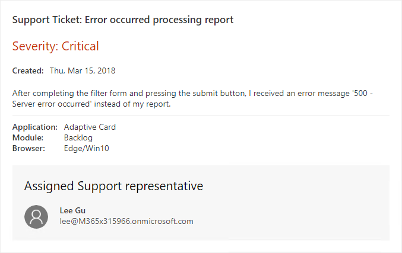
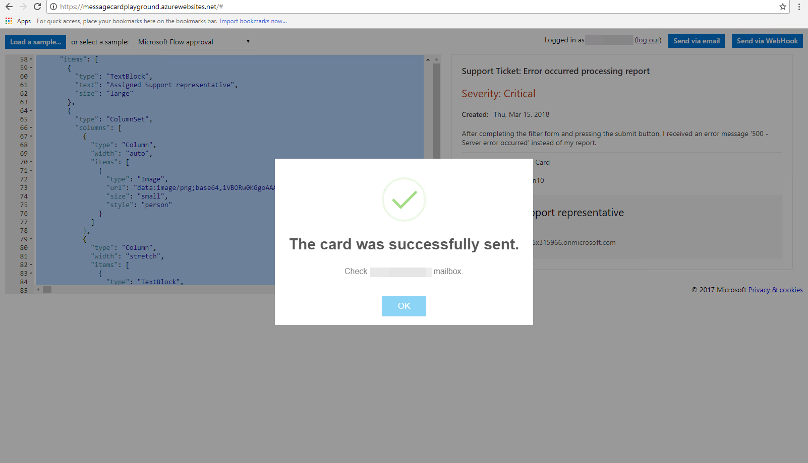
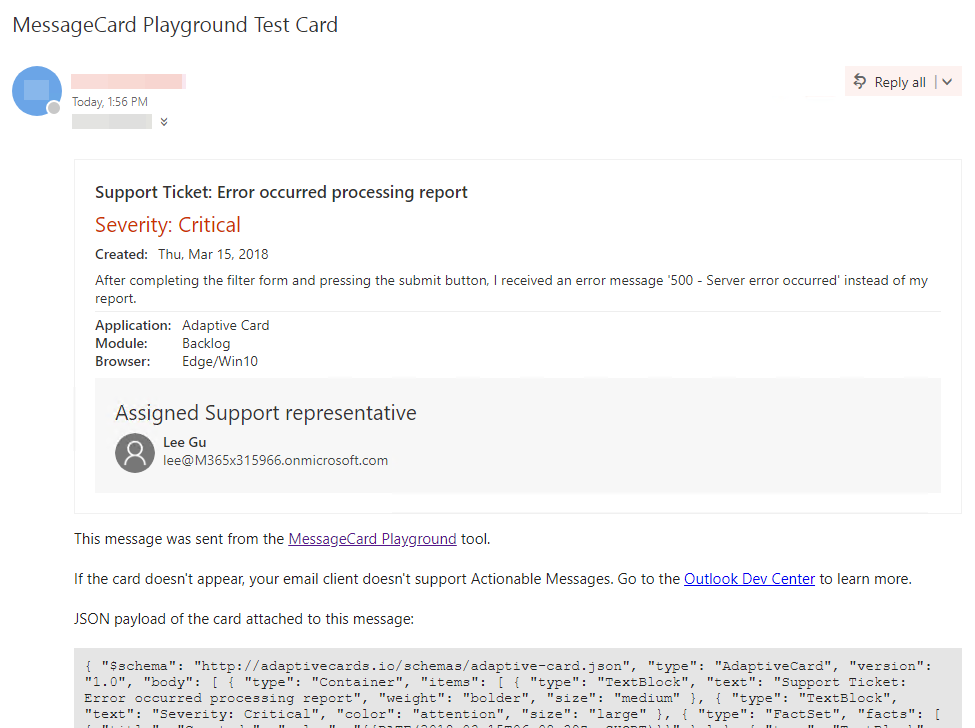

# Adaptive Cards – 300 Level

----------------
In this lab, you will walk through building an Adaptive Card, sending it to an inbox, and refreshing the card based on actions.

## Table of Contents

1. [Adaptive Card design and MessageCard Playground](#messagecardplayground)
2. [Adaptive Cards with Actions and Inputs](#actionsinputs)
3. [Card refresh](#cardrefresh)

## Prerequisites

This lab will require an Office 365 Tenant and a user account that has a mailbox.

> **NOTE - As of March, 2018, not all Office 365 Tenants support adaptive cards in Outlook.**

### Install developer tools

The developer workstation requires the following tools for this lab.

#### Download ngrok

The Connector registration process requires an endpoint accessible from the internet via HTTPS. To enable the exercises to work correctly, a tunneling application is required.

This lab uses [ngrok](https://ngrok.com) for tunneling publicly-available HTTPS endpoints to a web server running locally on the developer workstation. ngrok is a single-file download that is run from a console.

<a name="messagecardplayground"></a>

## Exercise 1. Adaptive Card design and MessageCard Playground

This lab will walk you through designing an Adaptive Card and sending it via the Message Card Playground.

### Visit the MessageCard Playground

Visit the [MessageCard Playground](https://messagecardplayground.azurewebsites.net/) app.

The MessageCard Playground provides a sandboxed environment with which to design and test your cards. You can choose from a list of existing samples or load your own sample. You can make modifications within the page that are shown visually, enabling you to quickly modify a card's design.

There are several samples of Adaptive Cards shown on the [Samples section of the Adaptive Cards site](http://adaptivecards.io/samples/).

For this lab, a sample card is provided that will be used and extended throughout the lab. The card represents a ticket opened in a fictitious support system.

### Load the sample

1. On the [MessageCard Playground](https://messagecardplayground.azurewebsites.net/) page, click the **Load a Sample...** button.
2. In the **Open file** dialog, navigate to the `LabFiles` folder. Select the file `supportTicketCard.json`

    

3. Review the card source and preview.

### Modify the sample

The card contains the severity level of the support ticket. Adaptive Cards allows for card authors to style the card's content to properly convey the information. Since the severity level of the ticket is Critical, update the card to highlight this information.

1. Locate the TextBlock containing the severity level. This block starts at line 15.

    

2. Add the following properties to the TextBlock:

    ```json
    "color": "attention",
    "size": "large"
    ```

3. Be sure to include commas where necessary to ensure the card source is properly formatted as JSON. When complete, the TextBlock definition should match the following image:

    

4. The updated card now shows the severity level in large red text.

    

### Send the card

1. Click **Send via Email** to send the card to yourself. You will be prompted to log in. If this is the first time using the Message Card Playground, you will be prompted for consent to send messages as you.

2. After log in and consent, a confirmation message will display.

    

3. Open Outlook. Select the message titled "MessageCard Playground Test Card." The message will contain the card, footer text with links about the playground and card documentation, and will show the JSON payload of the card.

    

<a name="actionsinputs"></a>

## Exercise 2. Adaptive Cards with Actions and Inputs

