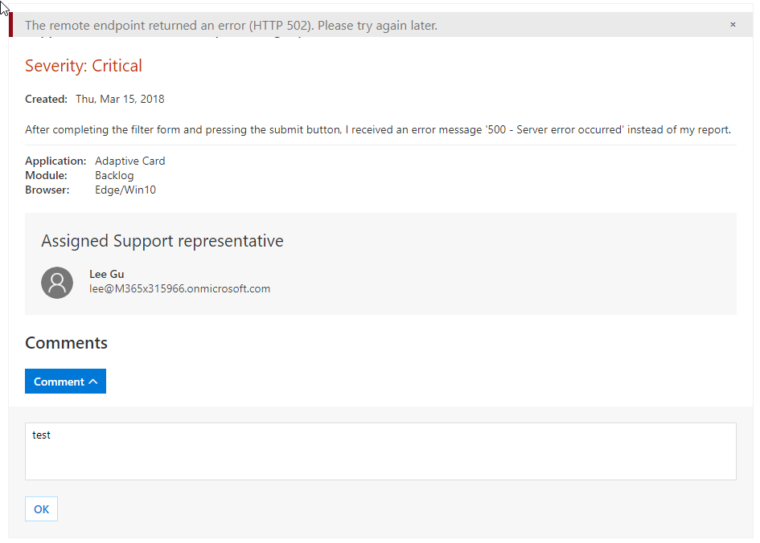

# Adaptive Cards – 300 Level

----------------
In this lab, you will walk through building an Adaptive Card, sending it to an inbox, and refreshing the card based on actions.

## Table of Contents

1. [Adaptive Card design and MessageCard Playground](#messagecardplayground)
1. [Adaptive Cards with Actions and Inputs](#actionsinputs)
1. [Card refresh](#cardrefresh)

## Prerequisites

This lab will require an Office 365 Tenant and a user account that has a mailbox.

> **NOTE - As of March, 2018, not all Office 365 Tenants support adaptive cards in Outlook.**

### Install developer tools

The developer workstation requires the following tools for this lab.

#### Download ngrok

The Connector registration process requires an endpoint accessible from the internet via HTTPS. To enable the exercises to work correctly, a tunneling application is required.

This lab uses [ngrok](https://ngrok.com) for tunneling publicly-available HTTPS endpoints to a web server running locally on the developer workstation. ngrok is a single-file download that is run from a console.

<a name="messagecardplayground"></a>

## Exercise 1. Adaptive Card design and MessageCard Playground

This exercise will walk you through designing an Adaptive Card and sending it via the Message Card Playground.

### Visit the Adaptive Card Visualizer

Visit the [Adaptive Card Visualizer](http://adaptivecards.io/visualizer) app.

The Adaptive Card Visualizer provides a sandboxed environment with which to design your adaptive card. More importantly, the Visualizer has a drop-down list of Host Apps that can render cards. Use this capability to verify how the card looks and acts in the target host app.


### Visit the MessageCard Playground

Visit the [MessageCard Playground](https://messagecardplayground.azurewebsites.net/) app.

The MessageCard Playground provides a sandboxed environment with which to design and test your cards. You can choose from a list of existing samples or load your own sample. You can make modifications within the page that are shown visually, enabling you to quickly modify a card's design.

There are several samples of Adaptive Cards shown on the [Samples section of the Adaptive Cards site](http://adaptivecards.io/samples/).

For this lab, a sample card is provided that will be used and extended throughout the lab. The card represents a ticket opened in a fictitious support system.

### Load the sample

1. On the [MessageCard Playground](https://messagecardplayground.azurewebsites.net/) page, click the **Load a Sample...** button.
1. In the **Open file** dialog, navigate to the `LabFiles` folder. Select the file `supportTicketCard.json`

    

1. Review the card source and preview.

### Modify the sample

The card contains the severity level of the support ticket. Adaptive Cards allows for card authors to style the card's content to properly convey the information. Since the severity level of the ticket is Critical, update the card to highlight this information.

1. Locate the TextBlock containing the severity level. This block starts at line 15.

    

1. Add the following properties to the TextBlock:

    ```json
    "color": "attention",
    "size": "large"
    ```

1. Be sure to include commas where necessary to ensure the card source is properly formatted as JSON. When complete, the TextBlock definition should match the following image:

    

1. The updated card now shows the severity level in large red text.

    

### Send the card

1. Click **Send via Email** to send the card to yourself. You will be prompted to log in. If this is the first time using the Message Card Playground, you will be prompted for consent to send messages as you.

1. After log in and consent, a confirmation message will display.

    

1. Open Outlook. Select the message titled "MessageCard Playground Test Card." The message will contain the card, footer text with links about the playground and card documentation, and will show the JSON payload of the card.

    

<a name="actionsinputs"></a>

## Exercise 2. Adaptive Cards with Actions and Inputs

This exercise will enhance the support ticket card from exercise 1 with Input and Action elements allowing comments on the support ticket directly from Outlook.

### Run the ngrok secure tunnel application

1. Open a new **Command Prompt** window.
1. Change to the directory that contains the ngrok.exe application.
1. run the command `ngrok http 8011`
1. The ngrok application will fill the entire prompt window. Make note of the Forwarding address using https. This address is required in the next step.
1. Minimize the ngrok Command Prompt window. It is no longer referenced in this exercise, but it must remain running.


### Update card and send via email

1. Launch Visual Studio 2017
1. Open the solution **LabFiles/send-adaptivecard-message/send-adaptivecard-message.sln**
1. Open the file **Card.json**.

We will extend the card with another element in the body as a header for comments.

1. Add a comma to the end of line 101.
1. Add the following snippet as lines 102 - 112.

    ````json
    {
      "type": "Container",
      "items": [
        {
          "type": "TextBlock",
          "text": "Comments",
          "size": "Large",
          "weight": "bolder"
        }
      ]
    }
    ````

We will add input and action controls to capture and submit the comments.

1. Add a comma to the end of line 113. (Line 113 is a closing bracket ']')
1. Add the following snippet as lines 114-142. This snippet should be outside of the **body** element. In the snippet, replace teh token [ngrok-url-here] with the https address displayed in the ngrok window.

    ````json
    "actions": [
      {
        "type": "Action.ShowCard",
        "title": "Comment",
        "card": {
          "type": "AdaptiveCard",
          "body": [
            {
              "type": "Input.Text",
              "id": "comment",
              "isMultiline": true,
              "placeholder": "Enter your comment"
            }
          ],
          "actions": [
            {
              "type": "Action.Http",
              "method": "POST",
              "title": "OK",
              "url": "[ngrok-url-here]",
              "headers": {
                "content-type": "application/json"
              },
              "body": "{ 'comment' : '{{comment.value}}' }"
            }
          ]
        }
      }
    ]
    ````

The complete card JSON can be found at **/Demos/02-CardWithActionAndInput/supprtTicketWithCommentsCard.json**.

Notice the **body** element of the **Action.Http** element. The body contains a token indicated with double braces ( ` '{{comment.value}}' ` ). Inside the braces is the name of the input control. When the action is performed, the value of the input control is inserted in this token.

### Review message format

1. In Visual Studio, open file **MessageBody.html**.
1. Notice that the `<head>` element contains a `<script>` tag. The type for the tag is `application/adaptivecard+json`. This value instructs Outlook that the following code should be interpreted as an Adaptive card.

### Send card via email

Compile and run the **send-adaptivecard-message** solution. The solution is a console application. The application will present an Azure Active Directory login prompt. Log in with your creadentials. (It is not necessary to have any specific permissions. The application will send a mail to the inbox associated to the account used to log in.)


The first time the application is run, you will be asked to consent the application.

The program will send the message and prompt to press any key to exit.

### View and interact with Adaptive Card

1. Open [Outlook for Web](https://outlook.office.com). Log in with the same credentials used to send the message.
1. Open the message. Notice the input box and OK button at the bottom of the message.


1. Enter a comment an click **OK**. Outlook will submit the card to the endpoint specified in the card. This submission will fail, since there is no web server listening at that address.



### Inspect Http POST message

The ngrok tunnel application received the submission from Outlook. We can view the POST message using the ngrok web interface.

1. Open a browser window to `http://localhost:4040`.
1. Click on the first request in the left column. In the right column, click on the link titled **Raw**.
1. Observe that the request contains an Authorization header and the body contains the value as defined in the card.


<a name="cardrefresh"></a>

## Exercise 3 - Card refresh
