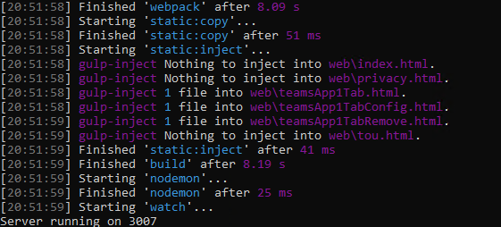
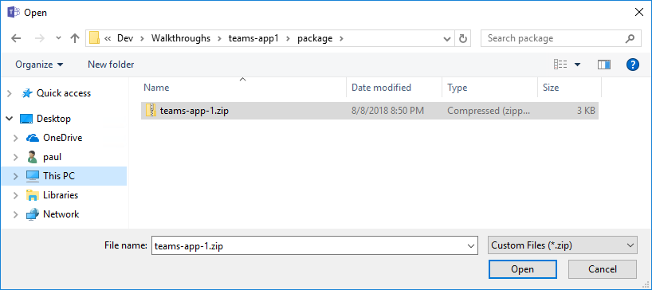

# Create and test a basic Microsoft Teams app using Yeoman

In this demo, you will demonstrate the Yeoman generator for Microsoft Teams, the ngrok tunnel application and the configurable tab functionality.

## Prerequisites

Developing apps for Microsoft Teams requires preparation for both the Office 365 tenant and the development workstation.

For the Office 365 Tenant, the setup steps are detailed on the [Getting Started page](https://msdn.microsoft.com/en-us/microsoft-teams/setup). Note that while the getting started page indicates that the Public Developer Preview is optional, this lab includes steps that are not possible unless the preview is enabled.

### Azure Subscription

The Azure Bot service requires an Azure subscription. A free trial subscription is sufficient.

### Install developer tools

The developer workstation requires the following tools for this lab.

#### Install NodeJS & NPM

Install [NodeJS](https://nodejs.org/) Long Term Support (LTS) version. If you have NodeJS already installed please check you have the latest version using `node -v`. It should return the current [LTS version](https://nodejs.org/en/download/). Allowing the **Node setup** program to update the computer `PATH` during setup will make the console-based tasks in this easier to accomplish.

After installing node, make sure **npm** is up to date by running following command:

````shell
npm install -g npm
````

#### Install Yeoman, Gulp-cli and TypeScript

[Yeoman](http://yeoman.io/) helps you start new projects, and prescribes best practices and tools to help you stay productive. This lab uses a Yeoman generator for Microsoft Teams to quickly create a working, JavaScript-based solution. The generated solution uses Gulp, Gulp CLI and TypeScript to run tasks.

Enter the following command to install the prerequisites:

````shell
npm install -g yo gulp-cli typescript
````

#### Install Yeoman Teams generator

The Yeoman Teams generator helps you quickly create a Microsoft Teams solution project with boilerplate code and a project structure & tools to rapidly create and test your app.

Enter the following command to install the Yeoman Teams generator:

````shell
npm install generator-teams -g
````

#### Download ngrok

As Microsoft Teams is an entirely cloud-based product, it requires all services it accesses to be available from the cloud using HTTPS endpoints. To enable the exercises to work within Microsoft Teams, a tunneling application is required.

This lab uses [ngrok](https://ngrok.com) for tunneling publicly-available HTTPS endpoints to a web server running locally on the developer workstation. ngrok is a single-file download that is run from a console.

#### Code editors

Tabs in Microsoft Teams are HTML pages hosted in an iframe. The pages can reference CSS and JavaScript like any web page in a browser.

Microsoft Teams supports much of the common [bot framework](https://dev.botframework.com/) functionality. The Bot Framework provides an SDK for C# and Node.

You can use any code editor or IDE that supports these technologies, however the steps and code samples in this training use [Visual Studio Code](https://code.visualstudio.com/) for tabs using HTML/JavaScript and [Visual Studio 2017](https://www.visualstudio.com/) for bots using the C# SDK.

#### Bot template for Visual Studio 2017

Download and install the [bot template for C#](https://github.com/Microsoft/BotFramework-Samples/tree/master/docs-samples/CSharp/Simple-LUIS-Notes-Sample/VSIX) from Github. Additional step-by-step information for creating a bot to run locally is available on the [Create a bot with the Bot Builder SDK for .NET page](https://docs.microsoft.com/en-us/azure/bot-service/dotnet/bot-builder-dotnet-quickstart?view=azure-bot-service-3.0) in the Azure Bot Service documentation.

  > **Note:** This lab uses the BotBuilder V3 SDK. BotBuilder V4 SDK was recently released. All new development should be targeting the BotBuilder V4 SDK. In our next release, this sample will be updated to the BotBuilder V4 SDK.

## Demo: Create and test a basic Microsoft Teams app using Yeoman

This exercise introduces the Yeoman generator and its capabilities for scaffolding a project and testing its functionality. In this exercise, you will create a basic Microsoft Teams App.

1. Open a **Command Prompt** window.

1. Change to the directory where you will create the tab.

     > **Note:** Directory paths can become quite long after node modules are imported.  It is recommended that you use a directory name without spaces in it and create it in the root folder of your drive.  This will make working with the solution easier in the future and protect you from potential issues associated with long file paths. In this example, you will use `c:\Dev` as the working directory.

1. Type `md teams-app1` and press **Enter**.

1. Type `cd teams-app1` and press **Enter**.

### Run the Yeoman Teams generator

1. Type `yo teams` and press **Enter**.

1. When prompted, accept the default **teams-app-1** as your solution name and press **Enter**.

1. Select **Use the current folder** for the file location and select **Enter**. The next set of prompts asks for specific information about your Microsoft Teams app:
    - Accept the default **teams app1** as the name of your Microsoft Teams app project and press **Enter**.
    - Enter your name and press **Enter**.
    - Accept the default selection for the manifest version you would like to use and press **Enter**.
    - Accept the default selection of **Tab** for what you want to add to your project and press **Enter**.
    - Enter **https://tbd.ngrok.io** as the URL where you will host this tab and press **Enter**. You will change this URL later in the exercise.
    - Enter *n* and press **Enter** when prompted to include a Test framework and initial tests.
    - Enter **n** and press **Enter** when prompted to use Azure Application Insights to telemetry.
    - Accept the default **teams app1 Tab** as the default tab name and press **Enter**.
    - Enter **n** and press **Enter** when prompted for the tab to be available in SharePoint Online.

      

    At this point, Yeoman will install the required dependencies and scaffold the solution files along with the basic tab. This might take a few minutes. When the scaffold is complete, you should see the following message indicating success.

    

### Review the generated solution

1. Launch **VS Code** by running the command `code .`

    

1. The source code for the application is in the **src\app** folder.

1. The **src\manifest** folder contains the assets required to create the Teams app package.

### Update the Microsoft Teams app manifest and create package

The generated application is ready to run. The generator created a gulp task to facilitate development. This task runs the following steps:

  1. Start the ngrok tunnel, capturing the temporary address
  1. Update the `manifest.json` file
  1. Package the manifest assets into a package (zip file)
  1. Transpile Typescript into Javascript
  1. Inject script and style tags into the generated html files
  1. Start a local web server to host the components

 Start this task by running the following command:

```shell
gulp ngrok-serve
```

  

  > Note: The gulp serve process must be running in order to see the tab in the Microsoft Teams application. When the process is no longer needed, press **CTRL+C** to cancel the server.

### Upload app into Microsoft Teams

1. In the Microsoft Teams application, select the **Create and join team** link. Then select the **Create team** button.

    

1. Enter a team name and description. In this example, the team is named **Training Content**. Select **Next**.

1. Optionally, invite others from your organization to the team. This step can be skipped in this lab.

1. The new team is shown. In the side panel on the left, select the ellipses next to the team name. Choose **Manage team** from the context menu.

    

1. On the Manage team menu, select **Apps** in the tab strip. Then select the **Upload a custom app** link at the bottom right corner of the application. If you don't have this link, check the sideload settings in the [Getting Started article](https://msdn.microsoft.com/en-us/microsoft-teams/setup).

    

1. Select the **teams-app-1.zip** file from the **package** folder. Select **Open**.

    

1. The app is displayed. Notice information about the app from the manifest (Description and Icon) is displayed.

    

The app is now uploaded into the Microsoft Teams application and the tab is available in the **Tab Gallery**.

### Add tab to team view

1. Tabs are not automatically displayed for the team. To add the tab, select **General** channel in the team.

1. Select the **+** icon at the end of the tab strip.

1. In the tab gallery, uploaded tabs are displayed in the **Tabs for your team** section. Tabs in this section are arranged alphabetically. Select the tab created in this lab.

    

1. The generator creates a configurable tab. When the tab is added to the team, the configuration page is displayed. Enter any value in the **Setting** box and select **Save**.

    

1. The value entered will then be displayed in the tab window.

    
